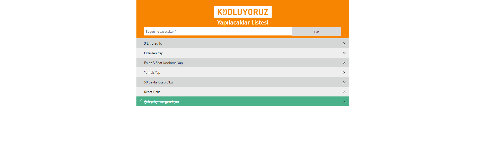
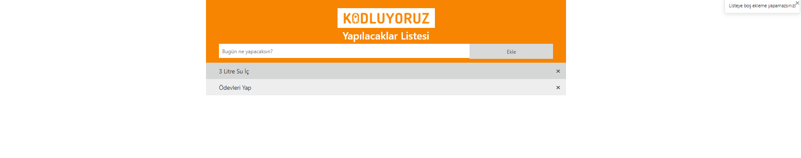

# toDoListApp
Patika.dev frontend patikası javascript dersi kapsamında; javascript kullanılarak toDoListApp uygulaması yapılmıştır. Ayrıca ödevde istenen bonus olarak (local storage) eklenmiştir.
# Ekran Alıntısı_1

# Ekran Alıntısı_2

# Ekran Alıntısı_2

